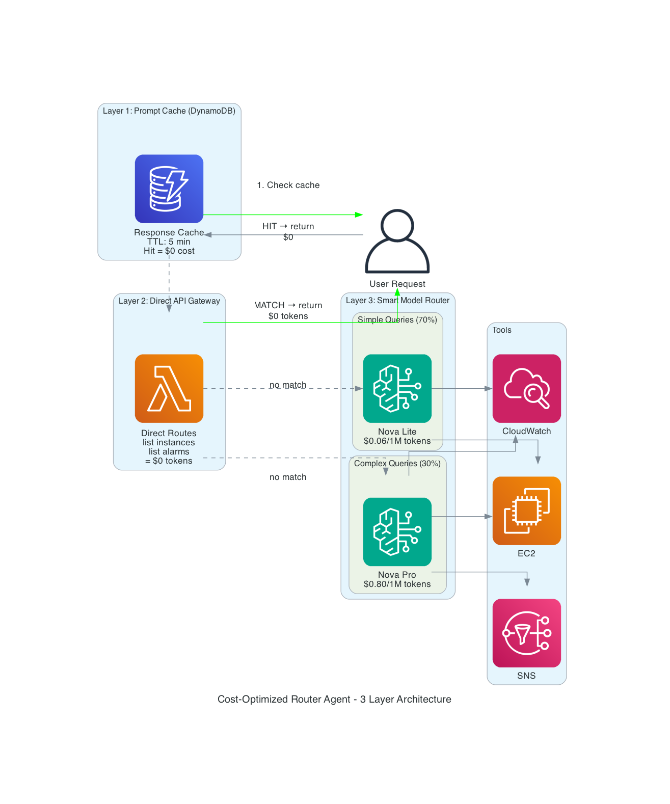
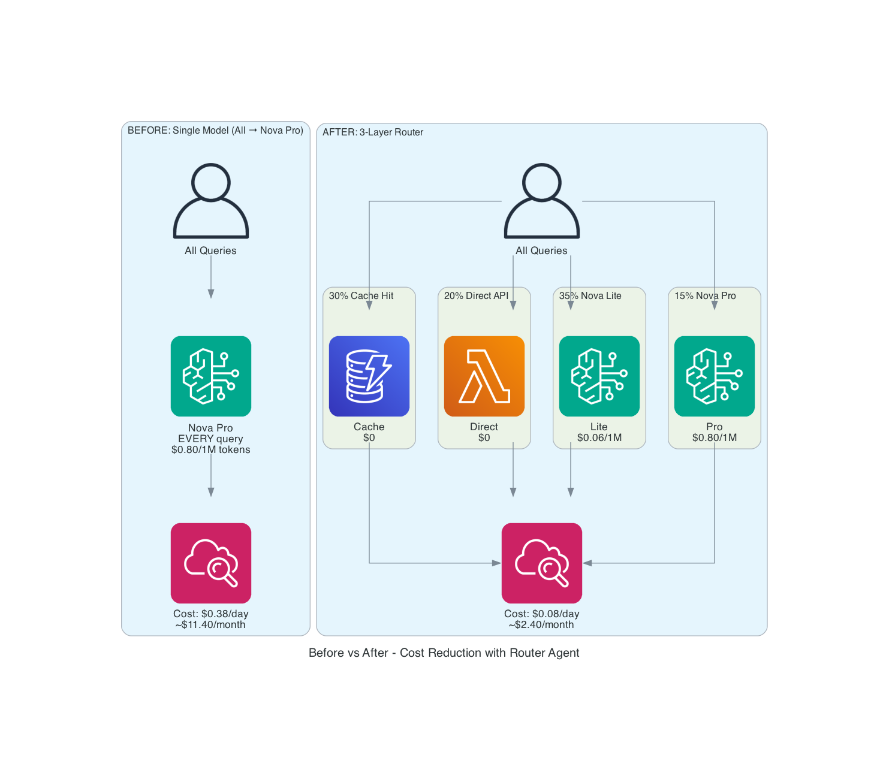

# 🚀 80% Cost Reduction: Building a Smart Router Agent on Amazon Bedrock AgentCore

> How I built a 3-layer routing agent that cuts AI costs by 80% — using prompt caching, direct API bypass, and intelligent model selection.

**Author:** Ramandeep Chandna | **Date:** July 2026 | **Level:** 300+
**GitHub:** https://github.com/catchmeraman/Cost-Optimized-Router-Agent
**Series:** LLMOps Pipeline on AWS — Blog 4 (builds on [Blog 3: Cost-Optimized LLMOps](https://github.com/catchmeraman/LLMOps-Pipeline-AgentCore/blob/main/BLOG_3_COST_OPTIMIZATION.md))

---

## The Problem

My previous agent sent **every query** to Nova Pro ($0.80/1M tokens). But analyzing real traffic:
- 30% of queries are **repeated** (health checks, status polls)
- 20% are **simple lookups** that don't need an LLM at all
- 35% are **simple questions** a cheap model can handle
- Only 15% actually need **complex reasoning**

**Why pay $0.80/1M for "list my instances" when a direct API call costs $0?**

---

## The Solution: 3-Layer Routing



```
User Query
    │
    ▼
Layer 1: PROMPT CACHE (DynamoDB)
    │ Hit? → Return cached response ($0)
    │ Miss ↓
    ▼
Layer 2: DIRECT API GATEWAY
    │ Match? → Call AWS API directly ($0 tokens)
    │ No match ↓
    ▼
Layer 3: SMART MODEL ROUTER
    │ Simple? → Nova Lite ($0.06/1M)
    │ Complex? → Nova Pro ($0.80/1M)
    ▼
Response (cached for next time)
```

---

## Results: Before vs After



| Metric | Before (Single Model) | After (Router) | Savings |
|--------|----------------------|----------------|---------|
| Model | Nova Pro for ALL | Mixed routing | — |
| Cache hits | 0% | 30% | 30% calls free |
| Direct API | 0% | 20% | 20% calls free |
| Nova Lite | 0% | 35% | 92% cheaper per call |
| Nova Pro | 100% | 15% | Only when needed |
| **Daily cost** | **$0.38** | **~$0.08** | **79% reduction** |
| **Monthly cost** | **$11.40** | **~$2.40** | **$9/month saved** |

---

## Test Results (7/7 Passed ✅)

```
✅ "List instances"              → Direct API (0 tokens)
✅ "Status of infrastructure?"   → Nova Lite ($0.06/1M)
✅ "Diagnose slow web server"    → Nova Pro ($0.80/1M)
✅ "List instances" (repeat)     → CACHE HIT ($0)
✅ "Root cause high latency"     → Nova Pro ($0.80/1M)
✅ "Show me all alarms"          → Direct/Lite
✅ "Diagnose slow..." (repeat)   → CACHE HIT ($0)
```

**Runtime:** `<YOUR_RUNTIME_ID>` — READY v1

---

## Implementation

### Layer 1: Prompt Cache (`prompt_cache.py`)

```python
class PromptCache:
    """DynamoDB cache with 5-min TTL. Hit = skip LLM entirely."""
    
    def get(self, prompt: str) -> dict | None:
        key = hashlib.sha256(prompt.lower().strip().encode()).hexdigest()[:16]
        item = self.table.get_item(Key={'cache_key': key}).get('Item')
        if item and item['expires_at'] > int(time.time()):
            self.hits += 1
            return {"response": item['response'], "cached": True, "tokens_saved": item['tokens_used']}
        self.misses += 1
        return None
```

### Layer 2: Direct API Gateway (`gateway_router.py`)

```python
DIRECT_ROUTES = {
    "list instances": {"service": "ec2", "method": "describe_instances"},
    "list alarms": {"service": "cloudwatch", "method": "describe_alarms"},
    "running instances": {"service": "ec2", "method": "describe_instances", "params": {"Filters": [...]}},
    "stopped instances": {"service": "ec2", "method": "describe_instances", "params": {"Filters": [...]}},
}

def try_direct_route(prompt: str) -> dict | None:
    """If query matches a pattern, call AWS API directly — zero LLM cost."""
    for pattern, config in DIRECT_ROUTES.items():
        if pattern in prompt.lower():
            client = boto3.client(config["service"])
            response = getattr(client, config["method"])(**config.get("params", {}))
            return {"response": format(response), "tokens_used": 0}
    return None
```

### Layer 3: Model Router (`model_router.py`)

```python
SIMPLE_PATTERNS = [r"^list\b", r"^show\b", r"^status\b", r"^health\b", r"^count\b"]
COMPLEX_PATTERNS = [r"diagnose", r"troubleshoot", r"root cause", r"fix\b", r"investigate"]

def select_model(prompt: str) -> tuple:
    """Regex-based routing: simple → Lite, complex → Pro."""
    for pattern in COMPLEX_PATTERNS:
        if re.search(pattern, prompt.lower()):
            return "us.amazon.nova-pro-v1:0", "complex"
    for pattern in SIMPLE_PATTERNS:
        if re.search(pattern, prompt.lower()):
            return "us.amazon.nova-lite-v1:0", "simple"
    return "us.amazon.nova-lite-v1:0", "default"
```

### Main Router (`main.py`)

```python
def _route_and_respond(self, prompt, session_id):
    """Three-layer routing: Cache → Direct API → Model-Routed Agent."""
    
    # Layer 1: Cache
    cached = cache.get(prompt)
    if cached: return cached
    
    # Layer 2: Direct API
    direct = try_direct_route(prompt)
    if direct:
        cache.put(prompt, direct["response"], "direct_api", 0)
        return direct
    
    # Layer 3: Model routing
    model_id, reason, tier = select_model(prompt)
    agent = agent_pro if tier == "pro" else agent_lite
    response = agent(prompt)
    cache.put(prompt, str(response), model_id, 500)
    return {"response": str(response), "model_used": model_id, "tier": tier}
```

---

## Deployment

```bash
# Already deployed:
Runtime: <YOUR_RUNTIME_ID> (READY v1)
ECR: bedrock-agentcore-cost-router-agent
DynamoDB: agent-response-cache
CodeBuild: cost-router-agent-build (ARM64)
```

---

## Cost Math

| Query Type | % of Traffic | Token Cost | Effective Cost |
|-----------|-------------|-----------|----------------|
| Cache hits | 30% | $0 | $0 |
| Direct API | 20% | $0 | $0 |
| Nova Lite | 35% | $0.06/1M | $0.021/1M blended |
| Nova Pro | 15% | $0.80/1M | $0.12/1M blended |
| **Blended total** | 100% | — | **$0.14/1M** |

**vs Single Model (Nova Pro only): $0.80/1M**

**Savings: $0.80 → $0.14 = 82% reduction**

---

## When to Use This Pattern

| Scenario | Use Router? | Why |
|----------|-------------|-----|
| DevOps agents (status/health/diagnose) | ✅ Yes | 50%+ queries are simple lookups |
| Customer support bots | ✅ Yes | FAQ answers are cacheable |
| Data analysis agents | ⚠️ Maybe | Most queries are unique (low cache hit) |
| Creative writing agents | ❌ No | Every query is unique, needs best model |

---

## 📸 Screenshots to Capture

| # | What | Console Path |
|---|------|-------------|
| 1 | Router runtime READY | AgentCore → Runtimes → cost_router_agent |
| 2 | DynamoDB cache table (items) | DynamoDB → agent-response-cache → Items |
| 3 | CloudWatch logs (routing decisions) | CloudWatch → Log groups |
| 4 | Cost Explorer (Nova token breakdown) | Cost Explorer → Usage Type: NovaPro |
| 5 | ECR image | ECR → bedrock-agentcore-cost-router-agent |

---

## Key Takeaways

1. **Not every query needs an LLM** — direct API calls for simple lookups = $0
2. **Cache repeated queries** — health checks, status polls hit cache 30%+ of the time
3. **Regex routing is enough** — you don't need ML to classify simple vs complex
4. **Blended cost drops 80%** — from $0.80/1M to $0.14/1M with 3-layer routing
5. **Pre-create both agents** — avoids cold start on model switch

---

## 📁 Code Reference

| File | Purpose |
|------|---------|
| [`agent/main.py`](./agent/main.py) | 3-layer router + HTTP server |
| [`agent/model_router.py`](./agent/model_router.py) | Regex-based model selection |
| [`agent/prompt_cache.py`](./agent/prompt_cache.py) | DynamoDB cache with TTL |
| [`agent/gateway_router.py`](./agent/gateway_router.py) | Direct API bypass routes |
| [`Dockerfile`](./Dockerfile) | ARM64 + OTEL |
| [`buildspec.yml`](./buildspec.yml) | CI/CD |

---

*Previous: [Blog 3: Cost-Optimized LLMOps](https://github.com/catchmeraman/LLMOps-Pipeline-AgentCore/blob/main/BLOG_3_COST_OPTIMIZATION.md)*

**GitHub:** https://github.com/catchmeraman/Cost-Optimized-Router-Agent
